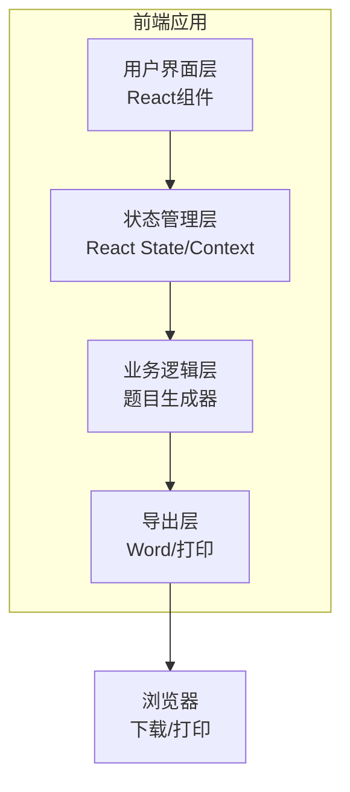

# 儿童算术练习小程序 技术架构文档

## 1. 架构设计



---

## 2. 技术栈

| 层级 | 技术选型 | 说明 |
|-----|---------|------|
| 框架 | React 18 | 组件化开发 |
| 构建工具 | Vite | 快速开发体验 |
| 样式 | Tailwind CSS | 响应式样式 |
| Word导出 | docx库 | 客户端生成docx |
| 图标 | Lucide React | 轻量图标库 |
| 存储 | localStorage | 保存用户偏好 |

---

## 3. 路由定义

| 路由 | 页面 | 功能 |
|-----|------|------|
| / | HomePage | 首页-版本选择和知识点列表 |
| /preview | PreviewPage | 题目预览页 |
| /export | ExportPage | 导出成功页 |

---

## 4. 核心模块设计

### 4.1 题目生成器 (QuestionGenerator)

```typescript
interface Question {
  id: string;
  type: 'oral' | 'vertical';
  content: string;
  answer: string;
  verticalFormat?: VerticalFormat;
}

interface VerticalFormat {
  top: string;      // 被除数/被加数
  bottom: string;   // 除数/加数
  operator: string; // 运算符
  result: string;   // 结果
  carries?: number[]; // 进位标记
  borrows?: number[]; // 退位标记
}
```

### 4.2 知识点配置 (KnowledgePoints)

```typescript
interface KnowledgePoint {
  id: string;
  name: string;
  grade: string;
  semester: '上' | '下';
  type: 'oral' | 'vertical';
  generator: string; // 生成器函数名
  range: {
    min: number;
    max: number;
    resultMax?: number;
  };
  examples: string[];
}
```

### 4.3 版本配置 (Versions)

```typescript
interface Version {
  id: string;
  name: string;
  displayName: string;
  knowledgePoints: KnowledgePoint[];
}
```

---

## 5. 组件结构

```
src/
├── components/
│   ├── VersionSelector.tsx      # 版本选择器
│   ├── KnowledgeCard.tsx        # 知识点卡片
│   ├── QuestionCounter.tsx      # 题目数量调整器
│   ├── QuestionPreview.tsx      # 题目预览区
│   ├── OralQuestion.tsx         # 口算题组件
│   ├── VerticalQuestion.tsx     # 竖式题组件
│   └── ExportButton.tsx         # 导出按钮
├── pages/
│   ├── HomePage.tsx             # 首页
│   ├── PreviewPage.tsx          # 预览页
│   └── ExportPage.tsx           # 导出页
├── generators/
│   ├── addition.ts              # 加法生成器
│   ├── subtraction.ts           # 减法生成器
│   ├── multiplication.ts        # 乘法生成器
│   ├── division.ts              # 除法生成器
│   ├── comparison.ts            # 比大小生成器
│   └── vertical.ts              # 竖式生成器
├── data/
│   └── knowledgePoints.ts       # 知识点配置数据
├── utils/
│   ├── docxExporter.ts          # Word导出工具
│   └── printUtils.ts            # 打印工具
├── context/
│   └── AppContext.tsx           # 全局状态管理
└── App.tsx                      # 应用入口
```

---

## 6. 数据模型

### 6.1 题目生成请求

```typescript
interface GenerateRequest {
  versionId: string;
  knowledgePointId: string;
  count: number;        // 题目数量 1-100
  withAnswer: boolean;  // 是否附带答案
  questionType: 'oral' | 'vertical' | 'both';
}
```

### 6.2 生成的练习卷

```typescript
interface Exercise {
  id: string;
  title: string;
  version: string;
  knowledgePoint: string;
  createdAt: Date;
  questions: Question[];
  hasAnswer: boolean;
}
```

---

## 7. Word导出规格

### 7.1 口算题格式
- 页面：A4纸张
- 布局：4列横向排列
- 题目数：约32题/页
- 字体：宋体14号
- 行距：1.5倍

### 7.2 竖式题格式
- 页面：A4纸张
- 布局：2列纵向排列
- 题目数：约20题/页
- 字体：宋体16号
- 竖式线：标准格式

### 7.3 文件结构
```
练习卷.docx
├── 第1页：空白练习卷（无答案）
└── 第2页：参考答案（如勾选打印答案）
```

---

## 8. 状态管理

使用React Context管理以下状态：

```typescript
interface AppState {
  currentVersion: string;
  currentKnowledgePoint: string;
  questionCount: number;
  withAnswer: boolean;
  generatedQuestions: Question[];
  exerciseHistory: Exercise[];
}

interface AppContextType {
  state: AppState;
  setVersion: (versionId: string) => void;
  setKnowledgePoint: (kpId: string) => void;
  generateQuestions: (count: number) => void;
  exportToWord: () => Promise<Blob>;
}
```

---

## 9. 本地存储

使用localStorage保存用户偏好：

| Key | 类型 | 说明 |
|-----|------|------|
| lastVersion | string | 上次选择的版本 |
| lastKnowledgePoint | string | 上次选择的知识点 |
| lastQuestionCount | number | 上次设置的题目数量 |
| lastWithAnswer | boolean | 上次答案选项 |
